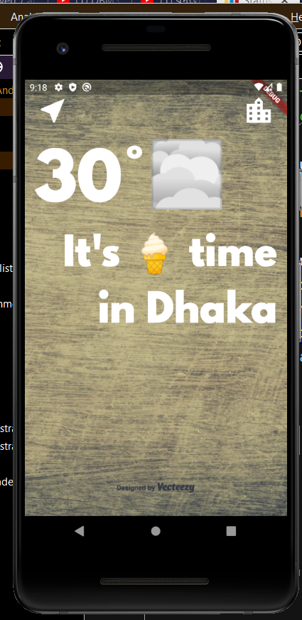
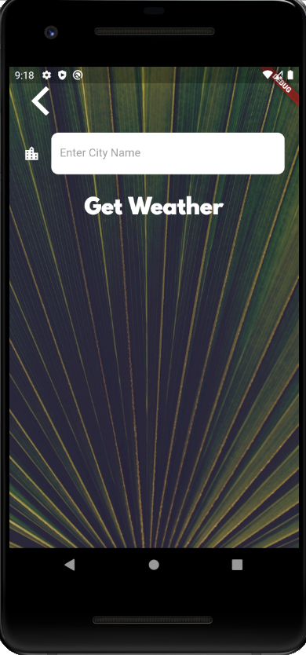
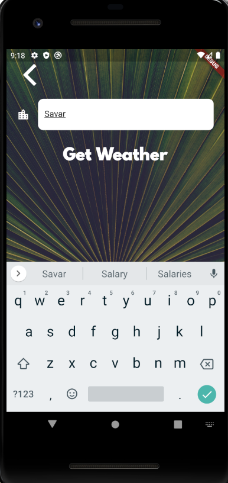
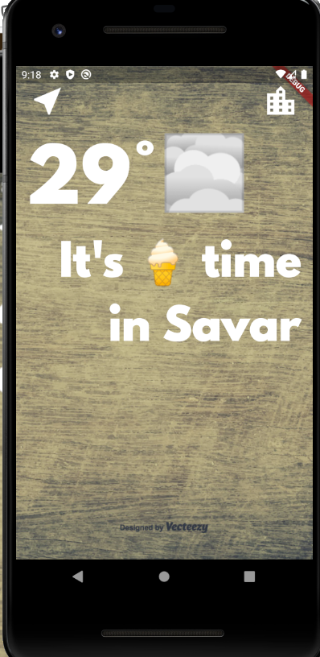

# WeatherApp
This is a simple weather app which can detect current location and can show the weather info.It is a flutter project ,for location 
detecting i used geolocator . Below how the UI looks

          
       

